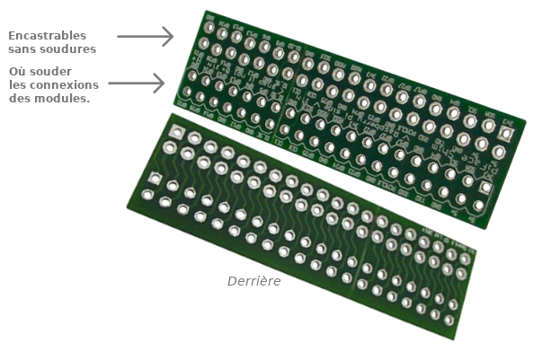

# Connexions pour les GPIO

## A- Connecteur fin type SHIM
Comme le nombre de connexions au Raspberry Pi est assez élevé ([voir tableau](##c--tableau-des-connexions)), j'ai besoin de créer un connecteur très fin qui s'imbriquera entre le Raspberry Pi et l'écran (mais aussi sur le Hat Mic+V3 :musical_note:).  
Les différents modules seront soudés sur ce connecteur fin, pas directement sur les GPIO.

Ce connecteur "*PiFace Shim I/O prototype extension for Raspberry Pi*" a existé mais est "**Discontinued**" et introuvable. :face_with_head_bandage: Il serait pourtant assez facile de le créer sous  par exemple et de le faire réaliser par  "PCB Way" ou "JLCPCB".

:bulb: ​Les trous réservés aux broches GPIO du RPi sont **décalés d' 1/4 de millimètres** une fois sur deux. Ce qui tord légèrement les broches et assure un bon contact électrique !!!

## B- Avantages

Ce connecteur type SHIM permettra :

- d'éviter de souder directement le RPi :fire:
- d'éviter de souder directement le module Mic+V3 et les autres modules :fire:
- plus de flexibilité et moins de risques pour un assemblage et une réparation plus facile.

Ce tout petit PCB devrait être très **bon marcher** à faire produire en quelques dizaines d'unités pour commencer. Il fera **gagner beaucoup de temps** :clock1: à l'assemblage et la réparation du **MAEL ScanPi**. Il fera **gagner de la place** :straight_ruler: et **évitera les risques** :warning: de mauvaises connexions.

## C- Tableau des connexions

| Module                                                       | Mode de connexion                              | GPIO utilisés |
| ------------------------------------------------------------ | ---------------------------------------------- | ------------- |
| Uninterruptible Power Supply UPS HAT For Raspberry Pi Zero   | Au dessous. Laisse les GPIO libres             |               |
| [mic+](https://raspiaudio.com/product/mic/) (DAC + Ampli / HP + Sortie Jack) | Ayant son propre connecté relié à celui du RPi |               |
| GM861S-LED                                                   | Soudé au connecteur du RPi                     |               |
| 2.13inch E-Paper HAT (B), 250x122, Red/Black/White, SPI Interface | Connecté comme Hat                             |               |
| MPR121 V12 - Capacitive Touch Sensor                         | Soudé au connecteur du RPi                     |               |
