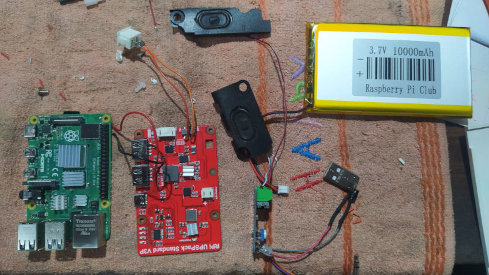
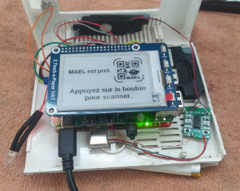
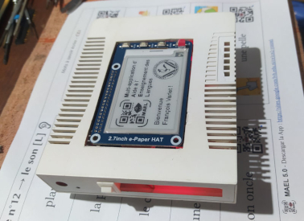
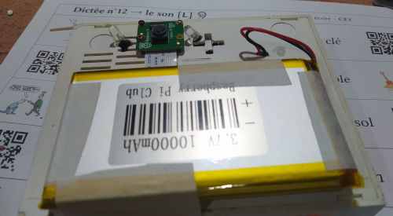
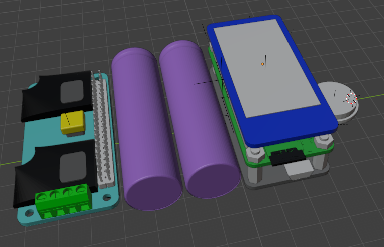
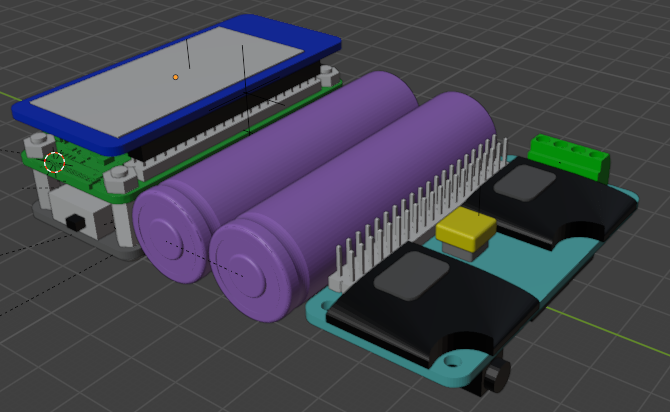

# MAEL Scan Pi

*Una aplicación perteneciente al [__proyecto MAEL__](https://github.com/Yobeco/MAEL_Project)*   
Copyright (c) 2024 Yonnel Bécognée

 

## :fr: [Français](https://github.com/Yobeco/MAEL_Phonofouille/blob/main/README.fr.md) | :es: [Español](https://github.com/Yobeco/MAEL_Phonofouille/blob/main/README.es.md)  | :gb: [English](https://github.com/Yobeco/MAEL_Phonofouille/blob/main/README.md)

---

## A- Descripción :eye:

**MAEL Scan Pi** es una aplicación integrada en Raspberry Pi  que permite a los alumnos escanear códigos QR creados por su profesor con **MAEL Gen** y escuchar su contenido :speaker: sin utilizar un teléfono móvil.  
Su interfaz está diseñada para ser utilizada por un niño a partir de los 4 años :baby:.

El objetivo de la versión sin teléfono es:

- evitar poner un teléfono en las manos (especialmente a los alumnos más jóvenes) :no_mobile_phones:
- crear un bonito objeto que encarne el inicio de un aprendizaje importante (contrato pedagógico).

**MAEL Scan Pi** permite a los alumnos que no poseen ningún “parlante” en casa escuchar el idioma estudiado dentro de un contexto pedagógico elaborado por su profesor :100:.  
De este modo, permite al profesor **potenciar la enseñanza de un idioma** :chart_with_upwards_trend:.

**¡Potencialmente se pueden implementar 55 idiomas!** :astonished:

:fr: :gb: :es: :portugal: :brazil: :it: :de: :ru: :jp: :cn: :kr: ...

---

## B- Funcionalidades :clipboard:

Ver el proyecto [**MAEL Scan**](https://github.com/Yobeco/MAEL_Scan)

---

## C- ¿Cómo utilizar MAEL Scan? :blush:

El uso deberá acercarse lo máximo posible a la versión para teléfono.  
Ver el proyecto [**MAEL Scan**](https://github.com/Yobeco/MAEL_Scan)

---

## D- Principio de funcionamiento :gear:

*(Para ayudar a la comprensión del código)*

---

El principio de funcionamiento será el mismo que el del proyecto [**MAEL Scan**](https://github.com/Yobeco/MAEL_Scan) para teléfono.

Sin embargo, MAEL Scan Pi posee propiedades de hardware específicas:

### "MAEL Scan Pi" V1

| Función | Solución elegida |
|--------|--------------------|
| Placa base | Raspberry Pi 4 8GB |
| Sistema operativo | [Pi OS Debian V13 (trixie)](https://www.raspberrypi.com/software/operating-systems/) |
| Síntesis de voz | [Piper TTS](https://github.com/OHF-Voice/piper1-gpl) |
| Reproducción de audio | aplay (Linux Bash) |
| UPS (gestión de baterías) | MakerFocus Raspberry Pi 4 Battery Pack UPS |
| Amplificador de audio | LM386 |
| Escáner de códigos QR | Módulo de cámara V2.1 |
| Reconocimiento de códigos QR | OpenCV |
| Pantalla | WaveShare 2.7inch E-Ink Display HAT |
| Carcasa | Carcasa reciclada de un módem antiguo |

**Ventajas:**

- Prototipo para descubrir las dificultades :face_with_peeking_eye:

**Desventajas:**

- Voluminoso :package:
- Carcasa poco ergonómica
- Difícil escanear los códigos QR (hay que tomar una foto y enviarla a OpenCV, que tiene dificultades para leer el código QR...) :face_with_diagonal_mouth:
- Interferencias muy molestas en el altavoz (LM386 sensible, sin preamplificador)

⟶ Desmontado para crear la versión 2

---

### "MAEL Scan Pi" V2

| Función | Solución actual | Precio |
|--------|--------------------|:--------:|
| Placa base | Raspberry Pi 4 8GB | $104 |
| Sistema operativo | [Pi OS Debian 13 (trixie)](https://www.raspberrypi.com/software/operating-systems/) | |
| Síntesis de voz | [Piper TTS](https://github.com/OHF-Voice/piper1-gpl) | |
| Reproducción de audio | aplay (Linux Bash) | |
| UPS (gestión de baterías) | MakerFocus Raspberry Pi 4 Battery Pack UPS | $33 |
| Amplificador de audio | PAM8403 Mini Module | $1 |
| Escáner de códigos QR | Useful Sensors Tiny Code Reader | $11 |
| Iluminación de códigos QR | 2 LED | |
| Pantalla con 4 botones | WaveShare 2.7inch E-Ink Display HAT | $23 |
| Carcasa | Carcasa reciclada de un módem antiguo | |
|  | Total: | +- $172 |

**Ventajas:**

- Funcional: códigos QR fácilmente escaneados :slightly_smiling_face:
- Síntesis de voz integrada (no se necesita conexión a internet)
- Buena autonomía :battery:
- Mejor calidad de sonido :musical_note: :+1:

**Desventajas:**

- Voluminoso
- Carcasa poco ergonómica
- Código QR limitado a 254 bytes, es decir, 40 caracteres ASCII (menos con acentos o caracteres extranjeros...). Es una limitación de hardware :straight_ruler: del sensor Tiny. **¡Insuficiente!**
- Algunos defectos ocasionales en la voz de Piper TTS :neutral_face: (¿Crear nuestro propio modelo de voz? Es posible)

⟶ Funcional, pero el código aún está desordenado

---

### "MAEL Scan Pi" V3

En construcción

| Función | Solución prevista | Precio |
|--------|--------------------|:--------------------:|
| Placa base | Raspberry Pi Zero 2W 512 MB (+ Zram) | $22 |
| Sistema operativo | [Pi OS Debian Lite V13 (trixie)](https://www.raspberrypi.com/software/operating-systems/) | |
| Síntesis de voz | GTTS (o servicio de síntesis de voz alojado en MAEL Phrase) | |
| Reproducción de audio | MOC (Music On Console) + SOX | |
| UPS (gestión de baterías) | Uninterruptible Power Supply UPS HAT para Raspberry Pi Zero | $24 |
| ~~Amplificador de audio~~ | ~~Audio Tech (B) Speaker Tech para Raspberry Pi Zero~~ Calidad de sonido deficiente :neutral_face: | ~~$4~~ |
| Amplificador de audio | [mic+](https://raspiaudio.com/product/mic/) (DAC + amplificador / altavoz + salida jack) | $35 |
| Escáner de códigos QR | GM861S-LED | $10 |
| Iluminación de códigos QR | Integrada en el módulo GM861S | |
| Pantalla | E-Paper HAT (B) de 2.13 pulgadas, 250x122, Rojo/Negro/Blanco, interfaz SPI | $15 |
| 6 botones "Touch" | MPR121 V12 – Sensor táctil capacitivo | $2 |
| Carcasa impresa en 3D | PET de botellas | ? |
|  | Total: | +- $104 |

Como todavía no existe una pantalla *3.52inch e-Paper Display (B), e-Ink Display, 360x240, Rojo/Negro/Blanco* que sea táctil para mostrar botones directamente en la pantalla, opté por sensores del tipo "touch sensor" colocados dentro de la carcasa.  
Por lo tanto, elegí una pantalla más pequeña (y más barata), pero con 3 colores :black_circle::white_circle::red_circle:. Perfecta para el logo de MAEL :smile:.  
Hice una prueba: un código QR grande (150px) puede contener aproximadamente 120 caracteres. Esta pantalla de 5 cm x 2.5 cm mostraría este texto a un tamaño de 11px, lo cual sigue siendo aceptable. (Será necesario realizar pruebas con un tamaño de fuente calculado en función del número de caracteres a mostrar...)

**Fortalezas:**

- Más pequeño y ligero :snowflake:
- Carcasa impresa en 3D prevista 
- ¡Pantalla de 3 colores!
- 6 botones táctiles (capacitivos, directamente dentro de la carcasa)
- ¡Salida de audio Jack! :headphones:
- Funcionalidad añadida: posibilidad de escanear un código QR generado por un teléfono :iphone: para compartir una conexión a internet Wi-Fi.

**Debilidades:**

- Requerirá una conexión para la síntesis de voz.

⟶ Ya tengo parte del hardware :hammer_and_wrench:.  
Sin embargo, a veces es caro :money_with_wings: y lento :calendar: hacer llegar material a Nicaragua :nicaragua: (donde vivo).

:eye: [**Ver el avance de la configuración de MAEL Scan Pi V3**](https://github.com/Yobeco/MAEL_Scan_Pi/blob/main/00-DVLP_plan_MAEL_Scan_pi_V3.md)  

1. Configuración del sistema operativo  
2. Utilidades CLI  
3. Instalación de módulos...

### :mechanical_arm: Necesidad de un especialista en diseño de PCB :ring_buoy:

Las conexiones internas requieren un pequeño [conector (PCB)](Connexions_GPIO_Shim.md) que deberá fabricarse a medida.

---

## E- Funcionalidades a desarrollar :rocket:

Las mismas que para **MAEL Scan**, pero a desarrollar en Python  en Raspberry Pi.

### :+1: Ofrece tu ayuda para desarrollar _MAEL Scan Pi_

**¿Tal vez un FabLab :nut_and_bolt: podría participar? :grin:**

---

## F- Participa en el proyecto MAEL :open_hands:

:ring_buoy: Para **obtener información** sobre el funcionamiento de **MAEL Scan Pi** :+1:, escríbeme aquí:

### :mailbox_with_mail: ***[mael@lvh.edu.ni](mailto:mael@lvh.edu.ni)***

### :star2: Contribuidores

¡Un gran agradecimiento a todas las personas que contribuirán a este proyecto!

| Avatar | Nombre             | GitHub                          | Rol                      |
|--------|--------------------|---------------------------------|--------------------------|
|  | Bécognée Yonnel | [@Yobeco](https://github.com/Yobeco)   | Mantenedor                |
|  | Padawan | [@Nail-yk](https://github.com/Nail-yk) | Traducción de la documentación |
| ... | ... | ... | Desarrollador |
| ... | ... | ... | Maker |

---

## G- Instalación :arrow_heading_down:

El código fuente del prototipo V2 todavía está demasiado desordenado como para atreverme a publicarlo en el repositorio. :disappointed:  
De hecho, paso directamente a la versión 3...