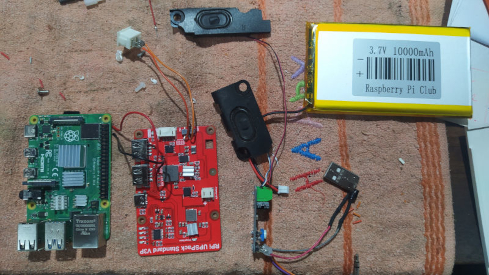
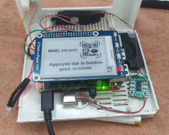

# MAEL Scan Pi

*Une application appartenant au [__projet MAEL__](https://github.com/Yobeco/MAEL_Project)*   
Copyright (c) 2024 Yonnel Bécognée

 

## :fr: [Français] | :gb: [English](https://github.com/Yobeco/MAEL_Scan_pi)

## A- Description :eye:

**MAEL Scan Pi** est une application embarquée sur Raspberry  Pi  qui permet à l'élève de flasher les code QR créés par son professeur avec **MAEL Gen** et d'écouter leur contenu :speaker: sans utiliser de téléphone portable.   
Son interface est conçue pour être utilisée par un enfant, dés 4 ans :baby:.

L'objectif de la version sans téléphone est de :

- ne pas mettre un téléphone dans les mains (surtout pour lesplus jeunes élèves). :no_mobile_phones:
- créer une bel objet incarnant le début d'un apprentissage important (Contrat pédagogique).

**MAEL Scan Pi** permet aux élèves ne possédant aucun "parlant" chez lui d'écouter la langue étudiée dans un contexte pédagogique élaboré par son professeur :100:. Il permet donc au professeur de **booster son enseignement d'une langue** :chart_with_upwards_trend:.

**Potentiellement 55 langues sont implémentables !** :astonished:

:fr: :gb: :es: :portugal: :brazil: :it: :de: :ru: :jp: :cn: :kr: ...

---

## B- Fonctionnalités :clipboard:

Voir le projet [**MAEL Scan**](https://github.com/Yobeco/MAEL_Scan)

---

## C- Comment utiliser MAEL Scan ? :blush:

L'utilisation devra s'approcher au mieux de la version téléphone.  
Voir le projet [**MAEL Scan**](https://github.com/Yobeco/MAEL_Scan)

---

## D- Principe de fonctionnement :gear:

*(Pour aider à la compréhension du code)*

---

Le principe de fonctionnement sera le même que le projet [**MAEL Scan**](https://github.com/Yobeco/MAEL_Scan) sur téléphone.

Cependant, MAEl Scan Pi possède des propriétés hardware particulières :

### "MAEL Scan Pi" V1

| Fonction | Solution choisie |
|--------|--------------------|
| Carte mère | Raspberry Pi 4 8Go |
| Système dexploitation | [Pi OS Debian V13 (trixie)](https://www.raspberrypi.com/software/operating-systems/) |
| Synthèse vocale | [Piper TTS](https://github.com/OHF-Voice/piper1-gpl) |
| Lecture audio | aplay (linux Bash) |
| UPS (gestion des batteries) | MakerFocus Raspberry Pi 4 Battery Pack UPS |
| Amplificateur audio | LM386  |
| Scanner les codes QR | module caméra V2.1 |
| Reconnaissance des codes QR | OpenCV |
| Écran | WaveShare 2.7inch E-Ink Display HAT |
| Boitier | Boitier recyclé d'un vieux modem |

**Qualités :**

- Prototype pour découvrir les difficultés :face_with_peeking_eye:

**Défauts :**

- Encombrant :package:
- Boitier peu ergonomique
- Difficile de scanner les codes QR (Il faut prendre une photo, l'envoyer à OpenCV qui peine à lire le code QR...) :face_with_diagonal_mouth:
- Parasites très génants dans le haut-parleur (LM386 sensible, sans pré-ampli)

⟶ Démantelé pour créer la version 2

---

### "MAEL Scan Pi" V2

| Fonction | Solution actuelle | Prix |
|--------|--------------------|:--------:|
| Carte mère | Raspberry Pi 4 8Go | 104$ |
| Système d’exploitation | [Pi OS Debian 13 (trixie)](https://www.raspberrypi.com/software/operating-systems/) | |
| Synthèse vocale | [Piper TTS](https://github.com/OHF-Voice/piper1-gpl) |  |
| Lecture audio | aplay (linux Bash) |  |
| UPS (gestion des batteries) | MakerFocus Raspberry Pi 4 Battery Pack UPS | 33$ |
| Amplificateur audio | PAM8403 Mini Module | 1$ |
| Scanner les codes QR | Useful Sensors Tiny Code Reader | 11$ |
| Éclairage des codes QR | 2 LED |  |
| Écran avec 4 boutons | WaveShare 2.7inch E-Ink Display HAT | 23$ |
| Boîtier | Boîtier recyclé d'un vieux modem |  |
|  | Total : | +- 172$ |

**Qualités :**

- Fonctionnel : codes QR facilement scannés :slightly_smiling_face:
- Synthèse vocale embarquée (pas besoin de connexion internet)
- Bonne autonomie :battery:
- Son de meilleure qualité :musical_note: :+1:

**Défauts :**

- Encombrant
- Boitier peu ergonomique
- Code QR de 254 octets max soit 40 caractères ASCII (moins si accents, caractères étrangers...). C'est une limite harware :straight_ruler: du Tiny sensor. **Insuffisant** ! 
- Quelques défauts parfois dans la voix Piper TTS :neutral_face: (Créer notre propre modèle de voix ? C'est possible)

⟶ Fonctionnel mais le code est encore brouillon

---

### "MAEL Scan Pi" V3

En cours de construction

| Fonction | Solution prévue | Prix |
|--------|--------------------|:--------------------:|
| Carte mère | Raspberry Pi zero 2W 512 Mo (+ Zram) | 22$ |
| Système d’exploitation | [Pi OS Debian Lite V13 (trixie)](https://www.raspberrypi.com/software/operating-systems/) |  |
| Synthèse vocale | GTTS (ou Service de synthèse vocale hébergée sur MAEL Phrase) |  |
| Lecture audio | MOC (Music On Consol) + SOX |  |
| UPS (gestion des batteries) | Uninterruptible Power Supply UPS HAT For Raspberry Pi Zero | 24$ |
| ~~Amplificateur audio~~ | ~~Audio Tech (B) Speaker Tech pour Raspberry Pi zero~~ Son de médiocre qualité :neutral_face: | ~~4$~~ |
| Amplificateur audio | [mic+](https://raspiaudio.com/product/mic/) (DAC + Ampli / HP + Sortie Jack) | 35$ |
| Scanner les codes QR | GM861S-LED | 10$ |
| Éclairage des codes QR | Intégré au module GM861S |  |
| Écran | 2.13inch E-Paper HAT (B), 250x122, Red/Black/White, SPI Interface | 15$ |
| 6 Boutons "Touch" | MPR121 V12 - Capacitive Touch Sensor | 2$ |
| Boîtier impression 3D | PET de bouteilles | ? |
|  | Total : | +- 104$ |

Comme il n'existe pas (encore) d'écran *3.52inch e-Paper Display (B), e-Ink Display, 360x240, Red/Black/White* qui soit tactile pour afficher les boutons sur l'écran, j'ai opté pour des capteurs type "touch sensor" qui seront à l'intérieur du boîtier.   
Et j'ai donc choisi un écran plus petit (et moins cher) mais en 3 couleurs :black_circle::white_circle::red_circle:. Parfait pour le logo de MAEL :smile:.  
J'ai fait un test : un gros code QR (150px) peut contenir +- 120 caractères. Cet écran de 5cm x 2.5cm afficherait ce texte en taille 11px, ce qui est encore acceptable. (Il faudra faire des essais avec une taille de caractère qui est calculée en fonction du nombre de caractères à afficher...)

**Qualités :**

- Plus petit et léger :snowflake:
- Un boîtier imprimé en 3D  prévu
- Écran 3 couleurs !
- 6 boutons tactiles (capacitifs, dans le boîtier directement)
- Sortie audio Jack ! :headphones:
- Ajout d'une fonctionnalité : possibilité de scanner un code QR généré par un téléphone :iphone: pour partager une connexion internet Wifi.

**Défauts :**

- Devra être connecté pour la voix de synthèse.

⟶ J'ai une partie du hardware :hammer_and_wrench:   
Mais il est parfois cher :money_with_wings: et long :calendar: de faire parvenir du matériel au Nicaragua :nicaragua: (où je vis).

:eye: [**Voir l'avancement de la configuration de MAEL Scan Pi V3**](https://github.com/Yobeco/MAEL_Scan_Pi/blob/main/00-DVLP_plan_MAEL_Scan_pi_V3.md)  

1. Configuration de l'OS
2. Utilitaires CLI
3. Installation des modules...

### :mechanical_arm: Besoin d'un spécialiste en création de PCB :ring_buoy:

Les connexions internes ont besoin d'un petit [connecteur (PCB)](Connexions_GPIO_Shim.md) qu'il faudrait fabriquer sur mesure.

---

## E- Fonctionnalités à développer :rocket:

Les mêmes que pour **MAEL Scan**, mais à développer en Python  sur Raspberry.

### :+1: Proposez votre aide pour developper _MAEL Scan Pi_

**Peut-être qu'un FabLab :nut_and_bolt: pourrait participer ? :grin:**

---

## F- Participez au projet MAEL :open_hands:

:ring_buoy: Pour **obtenir des informations** concernant le fonctionnement de **MAEL Scan Pi** :+1: écrivez-moi ici :

### :mailbox_with_mail: ***[mael@lvh.edu.ni](mailto:mael@lvh.edu.ni)***

### :star2: Contributeurs

Un grand merci à toutes les personnes qui vont contribuer à ce projet !

| Avatar | Nom                | GitHub                          | Rôle                     |
|--------|--------------------|---------------------------------|--------------------------|
|  | Bécognée Yonnel | [@Yobeco](https://github.com/Yobeco)   | Mainteneur                     |
|  | Padawan | [@Nail-yk](https://github.com/Nail-yk) | Traduction de la documentation |
| ... | ... | ... | Développeur (euse) |
| ... | ... | ... | Bricoleur (euse) |

---

## G- Installation :arrow_heading_down:

Mon code source du prototype V2 est encore trop désordonné pour que j'ose le mettre sur le dépôt. :disappointed:   
En fait, je passe directement à la version 3...
