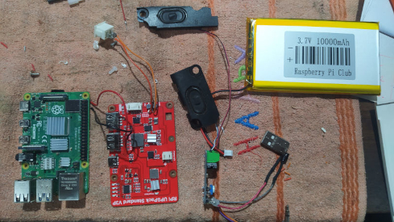
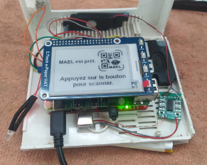
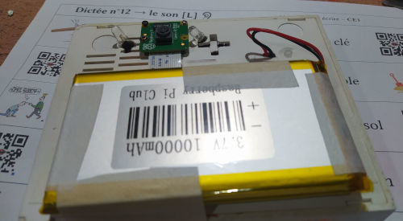

# MAEL Scan Pi

*Une application appartenant au [__projet MAEL__](https://github.com/Yobeco/MAEL_Project)*   
Copyright (c) 2024 Yonnel Bécognée

 

## :fr: [Français](https://github.com/Yobeco/MAEL_Scan_pi) | :gb: English

---

## A- Description :eye:

**MAEL Scan Pi** est une application embarquée sur Raspberry  Pi  qui permet à l'élève de flasher les code QR créés par son professeur avec **MAEL Gen** et d'écouter leur contenu :speaker: sans utiliser de téléphone portable.   
Son interface est conçue pour être utilisée par un enfant, dés 4 ans :baby:.

L'objectif de la version sans téléphone est de :

- ne pas mettre un téléphone dans les mains (surtout pour lesplus jeunes élèves). :no_mobile_phones:
- créer une bel objet incarnant le début d'un apprentissage important (Contrat pédagogique).

**MAEL Scan Pi** permet aux élèves ne possédant aucun "parlant" chez lui d'écouter la langue étudiée dans un contexte pédagogique élaboré par son professeur :100:. Il permet donc au professeur de **booster son enseignement d'une langue** :chart_with_upwards_trend:.

**Potentiellement 55 langues sont implémentables !** :astonished:

:fr: :gb: :es: :portugal: :brazil: :it: :de: :ru: :jp: :cn: :kr: ...

---

## B- Fonctionnalités :clipboard:

Voir le projet [**MAEL Scan**](https://github.com/Yobeco/MAEL_Scan)

---

## C- Comment utiliser MAEL Scan ? :blush:

L'utilisation devra s'approcher au mieux de la version téléphone.
Voir le projet [**MAEL Scan**](https://github.com/Yobeco/MAEL_Scan)

---

## D- Principe de fonctionnement :gear:

*(Pour aider à la compréhension du code)*

---

Le principe de fonctionnement sera le même que le projet [**MAEL Scan**](https://github.com/Yobeco/MAEL_Scan) sur téléphone.

Cependant, MAEl Scan Pi possède des propriétés hardware particulières :

### "MAEL Scan Pi" V1

| Fonction | Solution choisie |
|--------|--------------------|
| Carte mère | Raspberry Pi 4 8Go |
| Système dexploitation | [Pi OS Debian V13 (trixie)](https://www.raspberrypi.com/software/operating-systems/) |
| Synthèse vocale | [Piper TTS](https://github.com/OHF-Voice/piper1-gpl) |
| Lecture audio | aplay (linux Bash) |
| UPS (gestion des batteries) | MakerFocus Raspberry Pi 4 Battery Pack UPS |
| Amplificateur audio | LM386  |
| Scanner les codes QR | module caméra V2.1 |
| Reconnaissance des codes QR | OpenCV |
| Écran | WaveShare 2.7inch E-Ink Display HAT |
| Boitier | Boitier recyclé d'un vieux modem |

**Qualités :**

- Prototype pour découvrir les difficultés :face_with_peeking_eye:

**Défauts :**

- Encombrant :package:
- Boitier peu ergonomique
- Difficile de scanner les codes QR (Il faut prendre une photo, l'envoyer à OpenCV qui peine à lire le code QR...) :face_with_diagonal_mouth:
- Parasites très génants dans le haut-parleur (LM386 sensible, sans pré-ampli)

⟶ Démantelé pour créer la version 2

---

### "MAEL Scan Pi" V2

| Fonction | Solution actuelle |
|--------|--------------------|
| Carte mère | Raspberry Pi 4 8Go |
| Système dexploitation | [Pi OS Debian 13 (trixie)](https://www.raspberrypi.com/software/operating-systems/) |
| Synthèse vocale | [Piper TTS](https://github.com/OHF-Voice/piper1-gpl) |
| Lecture audio | aplay (linux Bash) |
| UPS (gestion des batteries) | MakerFocus Raspberry Pi 4 Battery Pack UPS |
| Amplificateur audio | XS9871 Mini Module de classe AB  |
| Scanner les codes QR | Useful Sensors Tiny Code Reader |
| Éclairage des codes QR | 2 LED |
| Écran | WaveShare 2.7inch E-Ink Display HAT |
| Boitier | Boitier recyclé d'un vieux modem |

**Qualités :**

- Fonctionnel : codes QR facilement scannés :slightly_smiling_face:
- Synthèse vocale embarquée (pas besoin de connexion internet)
- Bonne autonomie :battery:
- Son de meilleure qualité :musical_note: :+1:

**Défauts :**

- Encombrant
- Boitier peu ergonomique
- Code QR de 254 octets max soit 40 caractères ASCII (moins si accents, caractères étrangers...). C'est une limite harware :straight_ruler: du Tiny sensor. **Insuffisant** ! 
- Quelques défauts parfois dans la voix Piper TTS :neutral_face: (Créer notre propre modèle de voix ? C'est possible)

⟶ Fonctionnel mais le code est encore brouillon

---

### "MAEL Scan Pi" V3

En cours de construction

| Fonction | Solution prévue |
|--------|--------------------|
| Carte mère | Raspberry Pi zero 2W 512 Mo (+ Zram) |
| Système dexploitation | [Pi OS Debian Lite V13 (trixie)](https://www.raspberrypi.com/software/operating-systems/) |
| Synthèse vocale | GTTS (ou Service de synthèse vocale hébergée sur MAEL Phrase) |
| Lecture audio | aplay (linux Bash) |
| UPS (gestion des batteries) | Uninterruptible Power Supply UPS HAT For Raspberry Pi Zero |
| Amplificateur audio | RPi Speaker HAT PWM Sound Card GPIO Audio Amplification|
| Scanner les codes QR | GM861S-LED |
| Éclairage des codes QR | intégré au module GM861S |
| Écran | Waveshare 3.52inch e-Paper Display (B), e-Ink Red/Black/White |

**Qualités :**

- Plus petit et léger :snowflake:
- Boitier imprimé en 3D 
- Écran couleur
- Sortie audio Jack ! :headphones:

**Défauts :**

- Devra être connecté pour la voix de synthèse
- Des boutons à connecter à la carte mère au lieu d'un écran tactile. Plus compliqué ! :face_with_head_bandage:

⟶ J'ai une partie du hardware :hammer_and_wrench:   
Mais il est parfois cher :money_with_wings: et long :calendar: de faire parvenir du matériel au Nicaragua :nicaragua: (où je vis).

---

## E- Fonctionnalités à développer :rocket:

Les mêmes que pour **MAEL Scan**, mais en Python  sur Raspberry.

### :+1: Proposez votre aide pour developper _MAEL Scan Pi_

**Peut-être qu'un FabLab :nut_and_bolt: pourrait participer ? :grin:**

---

## F- Participez au projet MAEL :open_hands:

Pour **obtenir des informations** concernant le fonctionnement de **MAEL Scan Pi** :+1: écrivez-moi ici :

### :mailbox_with_mail: ***[mael@lvh.edu.ni](mailto:mael@lvh.edu.ni)***

### :star2: Contributeurs

Un grand merci à toutes les personnes qui vont contribuer à ce projet !

 | Avatar | Nom                | GitHub                          | Rôle                     |
 |--------|--------------------|---------------------------------|--------------------------|
 |  | Bécognée Yonnel | [@Yobeco](https://github.com/Yobeco) | Mainteneur |
 | ... | ... | ... | Développeur |
 | ... | ... | ... | Développeuse |
 | ... | ... | ... | Traductrice |

---

## G- Installation :arrow_heading_down:

Mon code source du prototype V2 est encore trop désordonné pour que j'ose le mettre sur le dépôt. :disappointed:   
Il faut que je trouve le temps de l'améliorer.

