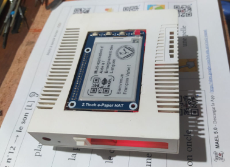

# MAEL Scan Pi

*An application belonging to the [__MAEL project__](https://github.com/Yobeco/MAEL_Project)*   
Copyright (c) 2024 Yonnel Bécognée

 

## :fr: [French](https://github.com/Yobeco/MAEL_Scan_Pi/blob/main/README.fr.md) | :gb: English

## A- Description :eye:

**MAEL Scan Pi** is an embedded application on Raspberry Pi  that allows students to scan QR codes created by their teacher with **MAEL Gen** and listen to their content :speaker: without using a mobile phone.   
Its interface is designed to be used by a child from age 4 :baby:.

The purpose of the phone-free version is to:

- avoid giving a phone to the hands (especially for younger students) :no_mobile_phones:
- create a nice object representing the beginning of an important learning process (Pedagogical contract).

**MAEL Scan Pi** allows students without any “speaker” at home to listen to the language being studied within a pedagogical context prepared by their teacher :100:. It thus allows the teacher to **boost language teaching** :chart_with_upwards_trend:.

**Potentially 55 languages can be implemented!** :astonished:

:fr: :gb: :es: :portugal: :brazil: :it: :de: :ru: :jp: :cn: :kr: ...

---

## B- Features :clipboard:

See the [**MAEL Scan**](https://github.com/Yobeco/MAEL_Scan) project

---

## C- How to use MAEL Scan? :blush:

Usage should mimic the phone version as closely as possible.  
See the [**MAEL Scan**](https://github.com/Yobeco/MAEL_Scan) project

---

## D- Operating principle :gear:

*(To aid code comprehension)*

---

The operating principle will be the same as the [**MAEL Scan**](https://github.com/Yobeco/MAEL_Scan) phone project.

However, MAEL Scan Pi has specific hardware properties:

### "MAEL Scan Pi" V1

| Function | Chosen solution |
|--------|--------------------|
| Motherboard | Raspberry Pi 4 8GB |
| Operating system | [Pi OS Debian V13 (trixie)](https://www.raspberrypi.com/software/operating-systems/) |
| Text-to-speech | [Piper TTS](https://github.com/OHF-Voice/piper1-gpl) |
| Audio playback | aplay (Linux Bash) |
| UPS (battery management) | MakerFocus Raspberry Pi 4 Battery Pack UPS |
| Audio amplifier | LM386 |
| QR code scanner | Camera module V2.1 |
| QR code recognition | OpenCV |
| Display | WaveShare 2.7inch E-Ink Display HAT |
| Case | Recycled old modem case |

**Strengths:**

- Prototype to explore difficulties :face_with_peeking_eye:

**Weaknesses:**

- Bulky :package:
- Case not ergonomic
- QR codes hard to scan (must take a photo, send it to OpenCV which struggles to read the QR code...) :face_with_diagonal_mouth:
- Strong interference in the speaker (LM386 sensitive, without preamp)

⟶ Dismantled to create version 2

---

### "MAEL Scan Pi" V2

| Function | Current solution | Price |
|--------|--------------------|:--------:|
| Motherboard | Raspberry Pi 4 8GB | $104 |
| Operating system | [Pi OS Debian 13 (trixie)](https://www.raspberrypi.com/software/operating-systems/) | |
| Text-to-speech | [Piper TTS](https://github.com/OHF-Voice/piper1-gpl) | |
| Audio playback | aplay (Linux Bash) | |
| UPS (battery management) | MakerFocus Raspberry Pi 4 Battery Pack UPS | $33 |
| Audio amplifier | PAM8403 Mini Module | $1 |
| QR code scanner | Useful Sensors Tiny Code Reader | $11 |
| QR code lighting | 2 LEDs | |
| Display with 4 buttons | WaveShare 2.7inch E-Ink Display HAT | $23 |
| Case | Recycled old modem case | |
|  | Total: | +- $172 |

**Strengths:**

- Functional: QR codes easily scanned :slightly_smiling_face:
- Embedded text-to-speech (no internet connection required)
- Good battery life :battery:
- Better sound quality :musical_note: :+1:

**Weaknesses:**

- Bulky
- Case not very ergonomic
- QR code limited to 254 bytes, i.e. 40 ASCII characters (less with accents or foreign characters...). This is a hardware limitation :straight_ruler: of the Tiny sensor. **Insufficient**!
- Occasional flaws in the Piper TTS voice :neutral_face: (Creating our own voice model? It is possible)

⟶ Functional, but the code is still messy

---

### "MAEL Scan Pi" V3

Under construction

| Function | Planned solution | Price |
|--------|--------------------|:--------------------:|
| Motherboard | Raspberry Pi Zero 2W 512 MB (+ Zram) | $22 |
| Operating system | [Pi OS Debian Lite V13 (trixie)](https://www.raspberrypi.com/software/operating-systems/) | |
| Text-to-speech | GTTS (or text-to-speech service hosted on MAEL Phrase) | |
| Audio playback | MOC (Music On Console) + SOX | |
| UPS (battery management) | Uninterruptible Power Supply UPS HAT for Raspberry Pi Zero | $24 |
| ~~Audio amplifier~~ | ~~Audio Tech (B) Speaker Tech for Raspberry Pi Zero~~ Poor sound quality :neutral_face: | ~~$4~~ |
| Audio amplifier | [mic+](https://raspiaudio.com/product/mic/) (DAC + amp / speaker + jack output) | $35 |
| QR code scanner | GM861S-LED | $10 |
| QR code lighting | Integrated into the GM861S module | |
| Display | 2.13inch E-Paper HAT (B), 250x122, Red/Black/White, SPI interface | $15 |
| 6 "Touch" buttons | MPR121 V12 – Capacitive Touch Sensor | $2 |
| 3D-printed case | PET from bottles | ? |
|  | Total: | +- $104 |

As there is no (yet) *3.52inch e-Paper Display (B), e-Ink Display, 360x240, Red/Black/White* that is touch-enabled to display buttons directly on the screen, I opted for "touch sensor" type sensors placed inside the case.   
I therefore chose a smaller (and cheaper) screen, but with 3 colors :black_circle::white_circle::red_circle:. Perfect for the MAEL logo :smile:.  
I ran a test: a large QR code (150px) can contain approximately 120 characters. This 5cm x 2.5cm screen would display this text at 11px, which is still acceptable. (Tests will be needed with a font size calculated based on the number of characters to display...)

**Strengths:**

- Smaller and lighter :snowflake:
- Planned 3D-printed case 
- 3-color screen!
- 6 touch buttons (capacitive, directly inside the case)
- Jack audio output! :headphones:
- Added feature: ability to scan a QR code generated by a phone :iphone: to share an internet Wi-Fi connection.

**Weaknesses:**

- Will require a connection for text-to-speech.

⟶ I already have part of the hardware :hammer_and_wrench:.   
However, it is sometimes expensive :money_with_wings: and slow :calendar: to get hardware shipped to Nicaragua :nicaragua: (where I live).

:eye: [**See the progress of the MAEL Scan Pi V3 configuration**](https://github.com/Yobeco/MAEL_Scan_Pi/blob/main/00-DVLP_plan_MAEL_Scan_pi_V3.md)  

1. OS configuration  
2. CLI utilities  
3. Module installation...

### :mechanical_arm: Need a PCB design specialist :ring_buoy:

The internal connections require a small custom-made [connector (PCB)](Connexions_GPIO_Shim.md).

---

## E- Features to be developed :rocket:

Same as for **MAEL Scan**, but to be developed in Python  on Raspberry Pi.

### :+1: Offer your help to develop _MAEL Scan Pi_

**Maybe a FabLab :nut_and_bolt: could participate? :grin:**

---

## F- Take part in the MAEL project :open_hands:

:ring_buoy: To **get information** about how **MAEL Scan Pi** works :+1:, write to me here:

### :mailbox_with_mail: ***[mael@lvh.edu.ni](mailto:mael@lvh.edu.ni)***

### :star2: Contributors

A big thank you to everyone who will contribute to this project!

| Avatar | Name               | GitHub                          | Role                     |
|--------|--------------------|---------------------------------|--------------------------|
|  | Bécognée Yonnel | [@Yobeco](https://github.com/Yobeco)   | Maintainer                |
|  | Padawan | [@Nail-yk](https://github.com/Nail-yk) | Documentation translation |
| ... | ... | ... | Developer |
| ... | ... | ... | Maker |

---

## G- Installation :arrow_heading_down:

The source code of the V2 prototype is still too messy for me to dare publish it in the repository. :disappointed:   
In fact, I am moving directly to version 3...